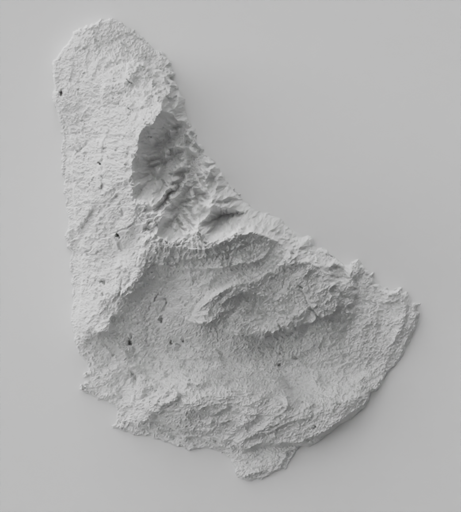
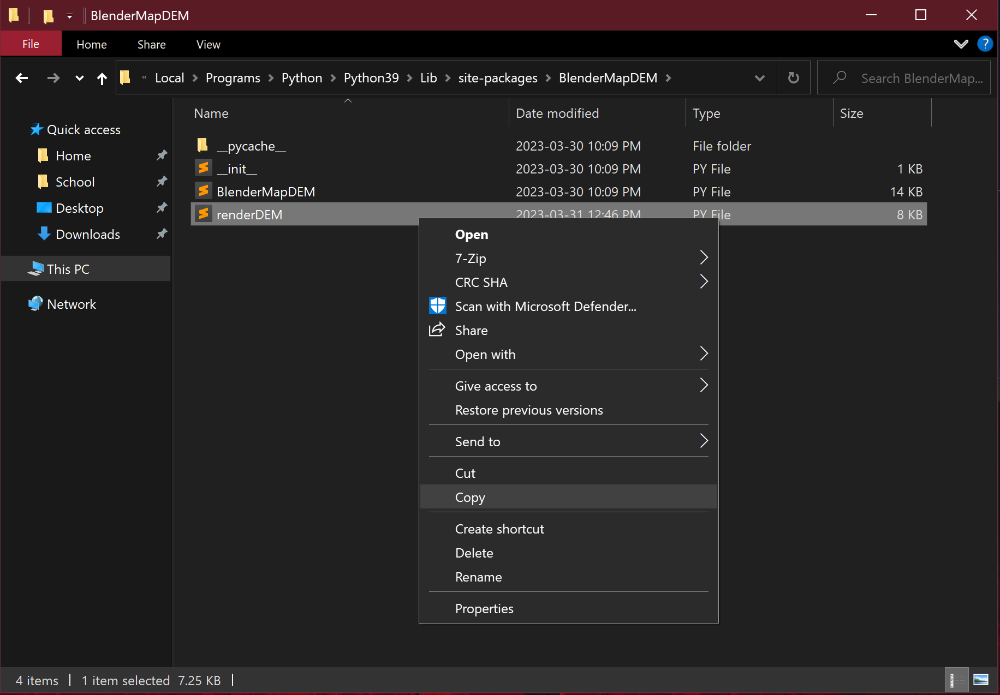
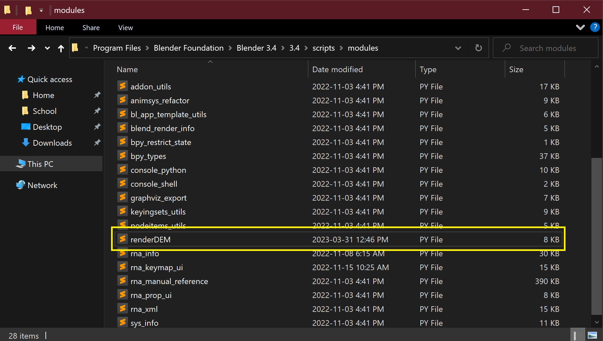

<p align="center">
  <a href="" rel="noopener">
 </a>
</p>

<h1 align="center">Blender DEM Visualization Toolkit</h3>

---
 
## 📝 Table of Contents <a name = 'contents'></a>
- [About](#about)
- [Getting Started](#getting_started)
- [Installation](#installation)
- [Functions in this Package](#functions)
    - [locationBounds()](#location)
    - [fetchDEM()](#fetch)
    - [fixNoData()](#nodata)
    - [plotDEM()](#plot)
    - [describeDEM()](#describe)
    - [reprojectDEM()](#reproject)
    - [clipDEM()](#clip)
    - [geotiffToImage()](#toimage)
    - [simplifyDEM()](#simplify)
    - [renderDEM()](#render)
    - [georeferenceImage()](#georeference)
- [Blender Usage](#usage)
    - [Render from python script using renderDEM()](#renderdemguide)
    - [Usage tips](#tips)
- [Acknowledgements](#acknowledgements)

<br/>

# 🧐 About <a name = "about"></a>
This is a python package of functions for creating 3D hillshade maps using Blender. It enables users with minimal Blender knowledge to fetch, clean, and visualize DEM data in the form of beautifully rendered hillshade maps.


This package is ultimately centered around its `renderDEM()` function which interfaces with Blender in order to generate a 3D rendered hillshade map using an input DEM image file.


All functions in this package are organized in a semi-modular way. They are created with the intent to be used together in sequence, however this is not required depending on your use-case. For example, if you only want to download DEM .geotiff files, perhaps you only need to use the `fetchDEM()` function, if you already have DEM .geotiff files from another source but need to convert them to a hillshade image and georeference them perhaps you only need the `geotiffToImage()`, `renderDEM()`, and `georeferenceImage()` functions.

<br/>

### What is DEM Data?
A digital elevation model (DEM) is a 3D representation of a terrain's surface, created using remote sensing technologies to model the elevation of the ground. Typically, within a DEM image each pixel carries its elevation data as values closer to white are higher and values closer to black are lower. These images can be fed into Blender to visualize this information in 3D space, creating high quality "hillshade" maps for use in cartography.

<br/>

### Why was this Package Created?
This package was created in response to the [growing popularity of people](https://old.reddit.com/r/MapPorn/search/?q=Blender&sort=top&restrict_sr=on&t=all) using the 3D modelling software "Blender" to create rendered hillshade maps out of DEM images.


Blender has several advantages over other methods of creating hillshade images featured in standard GIS programs as it realistically simulates lighting, allows the user enormous control over stylistic parameters, and can produce much more detailed and realistic 3D hillshade renders due to its specific strengths as a 3D modelling software.


There is, however, a knowledge barrier of entry as only people who know how to use Blender could create such hillshade maps, and the method was not easily automated to allow the input of any DEM and output a perfect hillshade every time. That is where this package comes in. The goal of this package is to allow the easy automation and generation of hillshade maps using simple python functions.

<br/>

# 🏁 Getting Started <a name = "getting_started"></a>
- Requirements:
    - [Blender](https://www.blender.org/download/)
    - [OpenTopography API key](https://portal.opentopography.org/lidarAuthorizationInfo?s=api)
    - Python 3.9


- Python dependencies:
    - PIL
    - requests
    - rasterio
    - matplotlib
    - numpy
    - fiona
    - geopy

This package requires an installation of **Blender**, a free and open-source 3D modelling software, in order to utilize the `renderDEM()` function. At the time of writing, this module is working as of Blender 3.5 (latest version) and can be downloaded [here](https://www.blender.org/download/).


This package also requires an [OpenTopography API key](https://portal.opentopography.org/lidarAuthorizationInfo?s=api), obtained for free by creating an account with OpenTopography, in order to to utilize the `fetchDEM()` function. This must be done in order for the function to access the global DEM datasets hosted by OpenTopography through their API.


Please refer to the `demo/` folder of this repository to view a [guided workflow demonstration](demo/demonstration_workbook.ipynb) using the functions of this package in the form of a jupyter notebook as well as find demonstration DEM files in the `demo/data` folder. You can also refer to the [Blender Usage](#usage) section of this document for information on using the `renderDEM()` function.

<br/>

# 🔧 Installation <a name = "installation"></a>
Please follow these steps to install this package and enable its functionality both with fetching DEM images (using OpenTopography), as well as rendering images (using Blender).

## Step 1: Preliminary Steps
Begin by first downloading [Blender](https://www.blender.org/download/) as well as obtain an [OpenTopography API key](https://portal.opentopography.org/lidarAuthorizationInfo?s=api).

<br/>

## Step 2: Install Package Through Git
Then, to install this package, run the following command in your terminal:

```bash
pip install git+https://github.com/Seb-geospatial/BlenderMapDEM
```

At this point, all functions within this package **EXCEPT** `renderDEM()` can be used in your own python developer environment. You should now have the ability to fetch and work with DEM data.


The reason you cant use the `renderDEM()` function at this point is because it requires that the `renderDEM.py` module is added to Blender's modules folder so that Blender knows what code to run when the `renderDEM()` function is called. We will do this in the following step.


If you call `renderDEM()` right now in a script you feed to Blender it will raise an error because it doesnt know where that function is. To add it to Blender see the following step.

<br/>

## Step 3: Add renderDEM.py to Blender's Modules Folder
Blender runs on an entirely separate python installation (based on python 3.7) and installing packages/modules with custom functions beyond its defaults can be tricky and tiresome as `pip` does not work natively.


To get around this we can simply add the python file within this package containing the `renderDEM()` function to Blenders own modules folder. This will allow any script that is given to python containing `renderDEM()` to run without errors.


First go to the directory this package was installed in to access its files and **copy** the `renderDEM.py` file (alternatively you could download this repository as a zip file and copy the file from there). By default (on Windows as of python 3.9) this is found here:

`C:\Users\USERNAME\AppData\Local\Programs\Python\Python39\Lib\site-packages\BlenderMapDEM`



Then **paste** this file into Blender's `scripts/modules` folder so the `renderDEM()` function will be callable by Blender's python interpreter. By default (as of Blender 3.5 on Windows) this folder is found here:

`C:\Program Files\Blender Foundation\Blender 3.5\3.5\scripts\modules`



<br/>

## Step 4: Using the Package
You can now `import BlenderMapDEM` and use the functions of this package within your python projects! Here is an example file:

```Python
# Example script which fetches a DEM, converts to image, and renders using Blender
from BlenderMapDEM import *

# Get DEM .geotiff file using fetchDEM()
fetchDEM(north_bound = 13.35,
         south_bound = 13.04,
         east_bound = -59.40,
         west_bound = -59.68,
         API_Key = '8da2375367b589517231f8fee1ae6b7c', # Input API key
         dataset = 'SRTMGL1', # Specify DEM dataset, in this case SRTM 30m resolution
         output_dir = './demo/data/BarbadosDEM.tif') # Specify output directory for map

# Use geotiffToImage() to generate viewable image file from .geotiff DEM file
geotiffToImage('./demo/data/BarbadosDEM.tif', './demo/data/BarbadosDEM_image.png')

# Specifying paths of blender.exe, input DEM image, and output rendered image
blender = 'C:/Program Files/Blender Foundation/Blender 3.5/blender.exe'
DEM =  'C:/Home/Documents/BlenderMapDEM/demo/data/BarbadosDEM_image.png'
output = 'C:/Home/Documents/BlenderMapDEM/demo/data/render.png'

# Use renderDEM to run blender from within this python script
renderDEM(blender_dir = blender, dem_dir = DEM, output_dir = output)
```


For more information on using Blender to execute this script, see the [Blender Usage](#usage) section.

<br/>

# 📦 Functions in this Package <a name = "functions"></a>
Below you will find documentation surrounding the functions featured in this package, their parameters, and usage examples.


The functions are roughly organized in the order they would most likely be used in, if you wish to find a specific function refer to the [table of contents](#contents). 


Again, please refer to the [guided workflow demonstration](demo/demonstration_workbook.ipynb) or [Blender Usage](#usage) section for a guide on how these functions can be used together to create hillshade maps in Blender.

<br/>

| **Function** | **Returns** | **Description** |
|--------------|-------------|-----------------|
| `locationBounds()` | Dictionary of bounds | Gets north, south, east, and west boundaries of any location by name |
| `fetchDEM()` | None; saves .geotiff file | Fetches and saves .GeoTIFF raster image containing DEM data for any specified extent |
| `fixNoData()` | None; overwrites .geotiff file | Fixes 'nodata' values to a specified pixel value |
| `plotDEM()` | Matplotlib plot | Plots an input DEM .geotiff file using rasterio and matplotlib |
| `describeDEM()` | Dictionary of DEM info | Returns a dictionary including important geospatial information about an input .geotiff DEM |
| `clipDEM()` | None; saves .geotiff file | Clips a .geotiff DEM raster image according to a geometry file |
| `reprojectDEM()` | None; saves .geotiff file | Reprojects an input .geotiff DEM file to a new EPSG coordinate system |
| `geotiffToImage()` | None; saves image file | Converts and saves a .geotiff file to a viewable image file that can be imported by non-GIS programs such as Blender |
| `simplifyDEM()` | None; saves image file | Downsamples an input DEM image to a lower resolution to ease computing requirements |
| `renderDEM()` | None; saves image file | Uses Blender to generate a 3D rendered hillshade map using an input DEM image |
| `georeferenceImage()` | None; saves .geotiff file | Georeferences an image file (such as a hillshade generated by Blender) according to metadata retrieved from an input .geotiff DEM file |

<br/>

## locationBounds() <a name = "location"></a>
```Python
locationBounds(location)
```

Uses the OpenStreetMap API to return a dictionary of north, south, east, and west boundaries. May be helpful for getting boundary information to use as input with `fetchDEM()`.

<br/>

Parameters:
- `location: str` **Requires string**
    - Name of the location you wish to retrieve a dictionary of boundaries of. Any location findable by name using OpenStreetMap is acceptable as input.
        - Example: `'Montreal'`, `'Montreal, Quebec'`, `'Montreal, Quebec, Canada'`

<br/>

Usage example:

```Python
# The following code returns a dictionary of north, south, east, and west latitude and longitude for the specified location of 'Montreal'

locationBounds('Montreal')

# Specific bounds can be accessed by specifying the bound
Montreal_north_bound = location('Montreal')['north']
Montreal_south_bound = location('Montreal')['south']
Montreal_east_bound = location('Montreal')['east']
Montreal_west_bound = location('Montreal')['west']
```

<br/>

## fetchDEM() <a name = "fetch"></a>
```Python
fetchDEM(north_bound, south_bound, east_bound, west_bound, API_Key, output_dir, dataset = 'SRTMGL1')
```

Uses the OpenTopography API in order to fetch a .GeoTIFF raster image containing DEM data for your specified extent that can then be opened using GIS programs. Fetching data may take a few minutes depending on size of request, this function works best for small extents.


It is important to note that each dataset has limitations on the amount of area it can retrieve, and that fetching DEM data of a very large extent may result in **extremely long query times**. Requests are limited to 500,000,000 km2 for GEDI L3, 125,000,000 km2 for SRTM15+ V2.1, 4,050,000 km2 for SRTM GL3, COP90 and 450,000 km2 for all other data.


The resulting .GeoTIFF DEM image, while openable in GIS programs, cannot be opened directly by a standard image viewer or Blender. This is because the image has no RGB color bands. Other geospatial operations can still be performed using the DEM .geotiff file before it is converted to a standard image file and imported into Blender.


**NOTE:** This function requires an OpenTopography API key in order to fetch maps from their database, obtained through [creating an account](https://portal.opentopography.org/newUser) on the OpenTopography website,

<br/>

Parameters:
- `north_bound: float` **Requires float**
    - Latitude coordinate of the northern bound of chosen DEM extent.
    - This value must be greater than `south_bound` in order to create a valid bounding box. Acceptable values range **between 90 and -90.**
- `south_bound: float` **Requires float**
    - Latitude coordinate of the southern bound of chosen DEM extent.
    - This value must be less than `north_bound` in order to create a valid bounding box. Acceptable values range **between 90 and -90.**
- `east_bound: float` **Requires float**
    - Longitude coordinate of the eastern bound of chosen DEM extent.
    - This value must be greater than `west_bound` in order to create a valid bounding box. Acceptable values range **between 180 and -180.**
- `west_bound: float` **Requires float**
    - Longitude coordinate of the western bound of chosen DEM extent.
    - This value must be less than `east_bound` in order to create a valid bounding box. Acceptable values range **between 180 and -180.**
- `API_Key: str` **Requires string**
    - OpenTopography API key, required for the function to fetch global DEM data made available by OpenTopography. Obtained free [here](https://portal.opentopography.org/lidarAuthorizationInfo?s=api).
- `output_dir: str` **Requires string**
    - Directory path to the fetched DEM (including .tif file extension).
    - Depending on the directory this function is being called in, you can use the relative path prefix `./` like this: `./output_here.tif` in order to save the output file in the directory it is called in.
        - Example: `'absolute/path/to/output.tif'` or `./relative_path_to_output.tif`
- `dataset: str` **Requires string and defaults to 'SRTMGL1'** 
    - Specifies the global raster DEM dataset hosted on OpenTopography to fetch data from.
    - Different datasets have different coverage, quality, cell resolution, or fetchable area limitations. In general, `'SRTMGL3'` (90m cell resolution) and `'SRTMGL1'` (30m cell resolution) are very high quality and widely used.
    - Available DEM datasets:
        - `'SRTMGL3'` (SRTM GL3 90m)
        - `'SRTMGL1'` (SRTM GL1 30m)
        - `'SRTMGL1_E'` (SRTM GL1 Ellipsoidal 30m)
        - `'AW3D30'` (ALOS World 3D 30m)
        - `'AW3D30_E'` (ALOS World 3D Ellipsoidal, 30m)
        - `'SRTM15Plus'` (Global Bathymetry SRTM15+ V2.1)
        - `'NASADEM'` (NASADEM Global DEM)
        - `'COP30'` (Copernicus Global DSM 30m)
        - `'COP90'` (Copernicus Global DSM 90m)
        - `'EU_DTM'` (DTM 30m)
        - `'GEDI_L3'` (DTM 1000m)

<br/>

Usage example:
```Python
# The following code fetches DEM data from OpenTopography using the SRTM GL1 30m dataset and a hypothetical API key

Key = '8da2375367b589517231f8fee1ae6b7c'

fetchDEM(north_bound = 50,
         south_bound = 49,
         east_bound = 81,
         west_bound = 80,
         API_Key = Key,
         output_dir = 'path/to/output/DEM.tif',
         dataset = 'SRTMGL1')
```

<br/>

## fixNoData() <a name = "nodata"></a>
```Python
fixNoData(geotiff_dir, nodata_value = 0)
```

Fixes the 'nodata' pixels of DEM .geotiff images to a specific value **(0 is recommended)** so that its data is more easily interpreted by `plotDEM()` and `geotiffToImage()`.


While not always needed, this function may be useful if your DEM .geotiff extent contains areas of no data (common with areas too far off a coast for example). The resulting 'nodata' pixel values may be set to an extremely low integer, resulting in odd outputs when it is visualized.

<br/>

Parameters:
- `geotiff_dir: str` **Requires string**
    - Directory path to the input DEM .geotiff file you wish to fix 'nodata' pixel values for (including .tif file extension).
    - Depending on the directory this function is being called in, you can use the relative path prefix `./` like this: `./DEM_here.tif` to select the DEM file in the directory it is called in.
        - Example: `'absolute/path/to/DEM.tif'` or `./relative_path_to_DEM.tif`
- `nodata_value: int` **Requires integer and defaults to 0**
    - Value to set 'nodata' pixel values to. If you intend to visualize the input DEM .geotiff, it is **strongly recommended** to keep to 0 (default) so that 'nodata' values will be treated as existing at sea-level.

<br/>

Usage example:

```Python
# The following code will fix the 'nodata' values within the input DEM .geotiff to be equal to 0

fixNoData(geotiff_dir = 'path/to/input/DEM.tif',
          nodata_value = 0)
```

<br/>

## plotDEM() <a name = "plot"></a>
```Python
plotDEM(geotiff_dir, histogram = True, colormap = 'Greys_r', plot_title = 'DEM Map')
```

Plots an input DEM .geotiff file using rasterio and matplotlib.

<br/>

Parameters:
- `geotiff_dir: str` **Requires string**
    - Directory path to the input DEM .geotiff file you wish to plot (including .tif file extension).
    - Depending on the directory this function is being called in, you can use the relative path prefix `./` like this: `./DEM_here.tif` to select the DEM file in the directory it is called in.
        - Example: `'absolute/path/to/DEM.tif'` or `./relative_path_to_DEM.tif`
- `histogram: bool` **Requires boolean and defaults to True**
    - Determines whether or not a histogram will be plotted alongside the default DEM plot showing a frequency distribution of elevation pixel values.
- `colormap: str` **Requires string and defaults to 'Greys_r'**
    - Defines the matplotlib cmap to be used for plotting the DEM.
    - The default grey colormap is how this file will be saved and inputted into Blender or other programs.
    - Any matplotlib cmap string can be used, however it is recommended to use the reverse version for most colormaps (specified by adding `_r` to the end of the string) so that lighter values are attributed to higher elevations.
- `plot_title: str` **Requires string and defaults to 'DEM Map'**
    - Specifies the title for plot.

<br/>

Usage example:
```Python
# The following code uses an input .geotiff DEM file to plot elevation values

plotDEM(geotiff_dir = 'path/to/input/DEM.tif',
        histogram = True,
        colormap = 'Greys_r',
        plot_title = 'DEM Map')
```

<br/>

## describeDEM() <a name = "describe"></a>
```Python
describeDEM(geotiff_dir)
```

Returns a dictionary including important geospatial information about an input .geotiff DEM.


Returns information on:
- Minimum elevation value (`min_elevation`)
- Maximum elevation value (`max_elevation`)
- Width of image in pixels (`width`)
- Height of image in pixels (`height`)
- Number of color bands (`bands`)
- Top left origin location in lat,long (`origin`)
- Bounds of image in the form of a dictionary containing north, south, east, west in latitude and longitude (`bounds`)
- Elevation value of missing data (`nodata`)
- CRS in the form of EPSG code (`crs`)

<br/>

Parameters:
- `geotiff_dir: str` **Requires string**
    - Directory path to the input .geotiff DEM file you wish to return information on (including .tif file extension).
    - Depending on the directory this function is being called in, you can use the relative path prefix `./` like this: `./DEM_here.tif` to select the DEM file in the directory it is called in.
        - Example: `'absolute/path/to/DEM.tif'` or `./relative/path/to/DEM.tif`

<br/>

Usage example:
```Python
# The following code uses an input .geotiff DEM file to return a dictionary object containing important geospatial information

describeDEM(geotiff_dir = 'path/to/input/DEM.tif')
```

<br/>

## reprojectDEM() <a name = "reproject"></a>
```Python
reprojectDEM(geotiff_dir, epsg_num, output_dir)
```

Reprojects an input .geotiff file to a specified EPSG crs code and saves a reprojected .geotiff output file.

<br/>

Parameters:
- `geotiff_dir: str` **Requires string**
    - Directory path to the input DEM .geotiff file to be reprojected (including .tif file extension).
    - Depending on the directory this function is being called in, you can use the relative path prefix `./` like this: `./DEM_here.tif` to select the DEM file in the directory it is called in.
        - Example: `'absolute/path/to/DEM.tif'` or `./relative/path/to/DEM.tif`
- `epsg_num: str` **Requires string (integer is also accepted)**
    - EPSG crs numeric code with which to reproject the input .geotiff file to.
    - Integer is also accepted, all that matters is that a valid numeric EPSG code is specified.
- `output_dir: str` **Requires string**
    - Directory path to the output reprojected .geotiff file (including .tif file extension).
    - Depending on the directory this function is being called in, you can use the relative path prefix `./` like this: `./output_here.tif` in order to save the output file in the directory it is called in.
        - Example: `'absolute/path/to/output.tif'` or `./relative/path/to/output.tif`

<br/>

Usage example:
```Python
# The following code reprojects an input .geotiff DEM file to a specified EPSG crs code and outputs a saves reprojected .geotiff file

reprojectDEM(geotiff_dir = 'path/to/input/DEM.tif',
             epsg_num = '32618',
             output_dir = 'path/to/output/DEM_reprojected.tif')
```

<br/>

## clipDEM() <a name = "crop"></a>
```Python
clipDEM(geotiff_dir, geometry_dir, output_dir, crop = True)
```

Clips an input .geotiff file according to polygon geometry found in a geometry file and saves a clipped .geotiff output file.

<br/>

Parameters:
- `geotiff_dir: str` **Requires string**
    - Directory path to the input DEM .geotiff file to be clipped (including .tif file extension).
    - Depending on the directory this function is being called in, you can use the relative path prefix `./` like this: `./DEM_here.tif` to select the DEM file in the directory it is called in.
        - Example: `'absolute/path/to/DEM.tif'` or `./relative/path/to/DEM.tif`
- `geometry_dir: str` **Requires string**
    - Directory path to the input geometry file containing polygons to clip the input .geotiff file (including file extension).
    - Supported geometry file formats include ".geojson", ".json", and ".shp".
        - For simplicity **".geojson" or ".json" is recommended**.
        - If using shapefile as input, make sure all required extra files such as the ".shx" file are located in the same directory.
    - Depending on the directory this function is being called in, you can use the relative path prefix `./` like this: `./geometry_here.geojson` to select the DEM file in the directory it is called in.
        - Example: `'absolute/path/to/geometry.geojson'` or `./relative/path/to/geometry.geojson`
- `output_dir: str` **Requires string**
    - Directory path to the output clipped .geotiff file (including .tif file extension).
    - Depending on the directory this function is being called in, you can use the relative path prefix `./` like this: `./output_here.tif` in order to save the output file in the directory it is called in.
        - Example: `'absolute/path/to/output.tif'` or `./relative/path/to/output.tif`
- `crop: bool` **Requires boolean and defaults to True**
    - Determines if to crop the image to the extent of the clipped geometry (`crop = True`), or if to leave the original extent of the input .geotiff intact, creating an "island" effect (`crop = False`)
    - If `crop = False` is set, all elevation values outside the clipped geometry are set to 0

<br/>

Usage example:
```Python
# The following code clips an input .geotiff DEM file according to a geometry file and saves the clipped .geotiff file

clipDEM(geotiff_dir = 'path/to/input/DEM.tif',
        geometry_dir = 'path/to/geometry.geojson',
        output_dir = 'path/to/output/DEM_clipped.tif',
        crop = True)
```

<br/>

## geotiffToImage() <a name = "toimage"></a>
```Python
geotiffToImage(geotiff_dir, output_dir)
```

Converts a .geotiff file (such as one gotten from OpenTopography) to a viewable image file that can be imported by non-GIS programs such as Blender. This allows the user to not have to import the OpenTopography .geotiff DEM file into GIS software and then export it as a viewable rendered image.


It is important to note that the resulting image is currently saved with **8-bit color depth**, meaning that elevation values stored in each pixel can exist in a range from 0-256. This is not ideal however the impacts to the image quality and the resulting 3D renders made from these images are extremely minimal.


It is also important to note that this function outputs an image file that, while readable by image viewers and Blender, is devoid of all geospatial metadata. Use this function towards the end your workflow before `simplifyDEM()` and `renderDEM()` when such metadata is no longer needed to generate a map.

<br/>

Parameters:
- `geotiff_dir: str` **Requires string**
    - Directory path to the input DEM .geotiff file you wish to convert to an image (including .tif file extension).
    - Depending on the directory this function is being called in, you can use the relative path prefix `./` like this: `./DEM_here.tif` to select the DEM file in the directory it is called in.
        - Example: `'absolute/path/to/DEM.tif'` or `./relative/path/to/DEM.tif`
- `output_dir: str` **Requires string**
    - Directory path to the output image file (including file extension).
    - Depending on the directory this function is being called in, you can use the relative path prefix `./` like this: `./output_here.png` in order to save the output file in the directory it is called in.
        - Example: `'absolute/path/to/output.png'` or `./relative/path/to/output.png`
    - While all standard image formats are acceptable as output, **converting the image to .png** is highly recommended as it results in the best quality retention.
    
<br/>

Usage example:
```Python
# The following code takes a non-viewable .geotiff DEM image and convert it into a viewable image that is readable by non-GIS programs such as Blender

geotiffToImage(geotiff_dir = 'path/to/dem.tif',
               output_dir = 'path/to/output/Image.png')
```

<br/>

## simplifyDEM() <a name = "simplify"></a>
```Python
simplifyDEM(dem_dir, output_dir, reduction_factor = 2)
```

Uses the PIL package to read in an input DEM image (of likely a high resolution) and output a downsampled image with lower file size and resolution using a resample method appropriate for DEM maps. May be helpful depending on your DEM data source for easing resource requirements when rendering images in Blender.


If you plan on georeferencing the final render **it is recommended you DONT use this function** in order to retain the best quality. The `georeferenceImage()` function requires the rendered hillshade and the initial DEM .geotiff containing metadata be the same resolution in order to correctly georeference, so if the rendered image is a lower resolution it will be up-scaled to the proper resolution automatically resulting in minor quality loss.


**NOTE:** this function does not work with .GeoTIFF DEM files which only contain 1 band geospatial metadata and must be opened in GIS programs. This function is intended to be used to prepare a viewable image file before it is imported into Blender to ease computational requirements on computers. Make sure to use `geotiffToImage()` before using this function.

<br/>

Parameters:
- `dem_dir: str` **Requires string**
    - Directory path to the input DEM image you wish to downsample (including file extension).
    - All standard image file types **except .jpg and .jpeg** are acceptable as input **including .tif/.tiff files**.
    - Depending on the directory this function is being called in, you can use the relative path prefix `./` like this: `./DEM_here.tif` to select the DEM file in the directory it is called in.
        - Example: `'absolute/path/to/DEM.tif'` or `./relative/path/to/DEM.tif`
- `output_dir: str` **Requires string**
    - Directory path to the outputted downsampled image (including file extension).
    - All standard image file types **except .jpg and .jpeg** are acceptable as output **including .tif/.tiff files**.
    - Depending on the directory this function is being called in, you can use the relative path prefix `./` like this: `./output_here.tif` in order to save the output file in the directory it is called in.
        - Example: `'absolute/path/to/output.tif'` or `./relative/path/to/output.tif`
    - Note that the output file can be the same as the input file and the function will overwrite the input file with the new resolution. This may be convenient for keeping a clean working directory however is more destructive as changes to the file cannot be reverted.
- `reduction_factor: int` **Requires integer and defaults to 2 (halves resolution)**
    - Refers to the integer by which to divide the input DEM resolution by. A `reduction_factor = 4` will result in a down-sampled image with a quarter of the original resolution, whereas a `reduction_factor = 10` will result in a down-sampled image with a tenth of the original resolution.
    - **Must be equal or greater than 2**
    - Be gentle with the amount you reduce the resolution by, depending on the size of your input image, reducing the resolution by more than half could have negative impacts on its clarity in the final rendered image.

<br/>

Usage example:
```Python
# The following code reduces the resolution of the input DEM to be a quarter of its original

simplifyDEM(dem_dir = 'path/to/dem.tif',
            output_dir = 'path/to/outputRender.png',
            reduction_factor = 2)
```

<br/>

## renderDEM() <a name = "render"></a>
```Python
renderDEM(blender_dir, dem_dir, output_dir, exaggeration = 1.0, shadow_softness = 90, sun_angle = 45, resolution_scale = 100, samples = 5)
```

Uses Blender to generate a 3D rendered hillshade map using an input DEM image file. The input DEM image must be viewable by non-GIS software, use `geotiffToImage()` to convert fetched DEM data from `fetchDEM()` into an image readable by Blender before using this function.


This function uses the subprocess package to automate running Blender through the terminal off of the `renderDEM.py` module added to Blender's modules directory which itself contains the real `renderDEM()` function that interfaces with Blender using its built-in `bpy` package. This function removes the need to run Blender manually, either through the terminal or GUI, in order to generate a rendered hillshade map using an input DEM.


It is important for this function, because it is really being run by Blender and not by code relative to your working directory, that you specify **absolute directory paths** for the parameters of `blender_dir`, `dem_dir`, and `output_dir`.


For more information on using Blender to execute this function, see the [Blender Usage](#renderdemguide) section.

<br/>

Parameters:
- `blender_dir: str` **Requires string**
    - Absolute directory path to the `blender.exe` executable file found in the installation directory of Blender which the subprocess package will execute using its `subprocess.run()` method.
    - By default (as of Blender 3.5 and on Windows) this path is found here:
        - `C:/Program Files/Blender Foundation/Blender 3.5/blender.exe`
    - If the Blender installation folder is added to your system's `PATH`, meaning it can be called by name in a terminal from any directory, this parameter can be set like this: `blender_dir = 'blender'`.
- `dem_dir: str` **Requires string**   
   - Absolute directory path to the input DEM image you wish to generate a hillshade of (including file extension). 
       - Example: `'absolute/path/to/DEM.tif'`
   - All standard image file types are acceptable as input and readable by Blender, **including .tif/.tiff files**.
    - This DEM image will be used by Blender to generate the hillshade using the greyscale pixel values (values closer to white represent high elevation, values closer to black represent low elevation).
- `output_dir: str` **Requires string**
    - Absolute directory path to the output rendered hillshade map (including file extension).
        - Example: `'absolute/path/to/render.png'`
    - All standard image file types are acceptable, **including .tif/.tiff files**.
- `exaggeration: float` **Requires float and defaults to 1.0**
    - Level of topographic exaggeration to be applied to 3D plane based on input DEM. Higher values will result in "spiky" terrain and darker crevices between landforms when viewed from above.
    - Generally values between 0.3 (relatively flat) to 1 (very spiky) produce good maps however there is no limit to how high this value can go.
    - Note that negative values are possible and will reverse the direction the terrain is exaggerated, "carving" the landscape underground.
- `shadow_softness: int` **Requires integer and defaults to 90 (relatively soft)**
    - This value specifically refers to the angular diameter of the sun's light source however functionally it can be understood as shadow softness.
    - Acceptable values range from 0-180 however best results will come between values of around 10-90; **values below 0 will be treated as 0 and values above 180 will be treated as 180.**
    - Low values (0-10) will result in very hard shadows as if the landscape is on the moon, and higher values (45-90) will result in softer more natural shadows
    - Values approaching 180 may result in unusual shadows.
- `sun_angle: int` **Requires integer and defaults to 45 (degrees)**
    - Vertical angle the sun is shining down on in degrees, mimicking how high the sun is in the sky.
    - Acceptable values range from 0-90; values both above 90 and below 0 are possible however may result in unusual shadows as the sun will shine from realistically impossible angles.
    - For reference a value of 90 will have the sun shining horizontally, a value of 0 will have it shining straight down, and a value of 45 will have it shining diagonally down allowing moderate shadows to be cast on the landforms.
- `resolution_scale: int` **Requires integer and defaults to 100**
    - Scale of the rendered image resolution in relation to the input DEM resolution in the form of percentage. An input DEM with resolution 2000x2000 and a `resolution_scale = 100` will result in a rendered image with resolution 2000x2000 (100% of input DEM), whereas `resolution_scale = 50` will result in a final render of 1000x1000 (50% of input DEM).
    - It is recommended to keep this value around or below 50 while performing test renders to improve speed before raising it to 100 (default value) for the final render at full resolution. Has a great affect on render speed and resource load on computer.
    - Note that if you intend to georeference the rendered image, your final render's `resolution_scale` should always be at least 100 so that the image wont need to be up-scaled automatically by `georeferenceImage()` resulting in quality loss.
- `samples: int` **Requires integer and defaults to 5**
    - Amount of samples to be used in the final render. Samples can be understood as how many "passes" Blender takes over the image during the rendering process, refining the image more and more each sample/pass, making it more clear and less noisy. Has an **extremely large** affect on render speed and resource load on computer.
    - Depending on the strength of your computer it is recommended to keep this value very low (from 1-10) while performing test renders before your final render where you can then raise it to anywhere from 20-500+ for crisp image quality.


When in doubt, the default values of the stylistic parameters `exaggeration`, `shadow_softness`, and `sun_angle`, as well as the quality parameters of `resolution_scale` and `samples`, will result in a very readable and realistic hillshade that can then be tweaked conservatively to your liking.

<br/>

Usage example:
```Python
# The following function uses Blender and the subprocess package to render a 3D hillshade map from within a python script


renderDEM(blender_dir = 'C:/Program Files/Blender Foundation/Blender 3.5/blender.exe',
          dem_dir = 'path/to/dem.tif',
          output_dir = 'path/to/outputRender.png',
          exaggeration = 0.5,
          shadow_softness = 75,
          sun_angle = 45,
          resolution_scale = 100,
          samples = 15)
```

<br/>

## georeferenceImage() <a name = "georeference"></a>
```Python
georeferenceImage(hillshade_dir, geotiff_dir, output_dir)
```

Converts an image file (such as a hillshade rendered in Blender) to a .geotiff file (such as the DEM used to create the hillshade) containing geospatial information. The image is georeferenced according to metadata retrieved from an input DEM .geotiff which should be the same .geotiff used to generate the hillshade in the first place.


If you georeference an image using metadata from an input .geotiff that was not used to create the hillshade image (or does does not cover the same extent and has the same projection), the image will be georeferenced according to the metadata of whatever input .geotiff was provided. This will result in the output .geotiff image being georeferenced to the wrong location and will contain the wrong geospatial metadata.

<br/>

Parameters:
- `hillshade_dir: str` **Requires string**
    - Directory path to the rendered hillshade image that was created by Blender that you wish to apply geospatial metadata to (including file extension).
    - This file was generated in Blender with the use of a DEM image that was previously converted from a .geotiff file to an image file and thus lost its geospatial metadata in order for it to be readable by Blender.
    - Depending on the directory this function is being called in, you can use the relative path prefix `./` like this: `./DEM_here.tif` to select the DEM file in the directory it is called in.
        - Example: `'absolute/path/to/render.png'` or `./relative/path/to/render.png`
- `geotiff_dir: str` **Requires string**
    - Directory path to the input DEM .geotiff file containing geospatial metadata to be given to the input render image (including .tif file extension). 
    - It is important that whatever .geotiff file being specified as input is the same DEM .geotiff file that was converted to an image using `geotiffToImage()` and used to generate the rendered hillshade using `renderDEM()` in the first place. This .geotiff already has all the correct geospatial metadata of the rendered hillshade image that was lost when the DEM had to be converted to an image for use in Blender, this function is just re-attributing it to the final rendered image.
    - Depending on the directory this function is being called in, you can use the relative path prefix `./` like this: `./DEM_here.tif` to select the DEM file in the directory it is called in.
        - Example: `'absolute/path/to/DEM.tif'` or `./relative/path/to/DEM.tif`
- `output_dir: str` **Requires string**
    - Directory path to the output georeferenced image file (including .tif file extension).
    - Depending on the directory this function is being called in, you can use the relative path prefix `./` like this: `./output_here.tif` in order to save the output file in the directory it is called in.
        - Example: `'absolute/path/to/output.tif'` or `./relative/path/to/output.tif`

<br/>

Usage example:
```Python
# The following code applies the geospatial metadata of a .geotiff DEM file to a rendered hillshade image created in Blender generated using the same DEM data

georeferenceImage(hillshade_dir = 'path/to/rendered_hillshade.png',
                  geotiff_dir = 'path/to/DEM.geotiff',
                  output_dir = 'path/to/render_georeferenced.tif')
```

<br/>

# 🗺️ Blender Usage <a name = "usage"></a>
See this [guided workflow demonstration](demo/demonstration_workbook.ipynb) in the form of a jupyter notebook for a more detailed step-by step guide on using the functions in this package cohesively.


There are a variety of ways to use Blender to run python scripts, below you will be instructed on how fetch DEM .geotiff files with `fetchDEM()`, convert them to usable images with `geotiffToImage()`, and finally how to trigger Blender to start rendering according to user parameters from within a terminal/python environment using the `renderDEM()` function.
    

Ensure that you have completed all the steps outlined in the [installation section](#installation) which involved adding the `renderDEM.py` file of this repository to Blender's modules folder. This is a crucial step so that Blender knows which code to run when the `renderDEM()` function is called.


Optionally (but less conveniently), Blender can also be run off a python script which imports `renderDEM` and calls the `renderDEM()` function found within the `renderDEM.py` file (a process which is being automated by the identically named `renderDEM()` function found within the `BlenderMapDEM.py` file). This can either be done in the terminal or using the "Scripting" workspace within Blender's GUI. Keep in mind using such a method is only useful if you wish to generate the map and explore the created Blender project and perhaps save the 3D model file for other purposes such as 3D printing instead of having it automatically render, save an image, and close.

<br/>

## 🖥️ Render Map from Python Script Using renderDEM() <a name = "renderdemguide"></a>
To run Blender from within a python script (such as the same one which fetched, manipulated, and then converted a DEM map to an image file), simply use the `renderDEM()` function.


The following method is very similar to running Blender as a terminal instance and specifying a path to a python script to run off of (done through specifying the command line arguments of `--background` and `--python`), however it does this within a python script itself using the `subprocess` package.


This way all functions in this package can be run from within a single python file, allowing you to make use of all functions from `fetchDEM()` to `renderDEM()` without having to leave your python development environment so long as you correctly point the `renderDEM()` function to Blender's executable file.


This function takes in 3 required parameters and uses the `subprocess` package to automate the process of running Blender in the terminal according to these parameters:
- `blender_dir` which points to the directory of Blender's executable file.
- `DEM_dir` which points to the input directory of the DEM image you wish to produce a map of.
- `output_dir` which points to the output directory that the rendered image should be saved to.


```Python
# Example script which fetches a DEM, converts to image, and renders using Blender
from BlenderMapDEM import *

# Get DEM .geotiff file using fetchDEM()
fetchDEM(north_bound = 13.35,
         south_bound = 13.04,
         east_bound = -59.40,
         west_bound = -59.68,
         API_Key = '8da2375367b589517231f8fee1ae6b7c', # Input API key
         dataset = 'SRTMGL1', # Specify DEM dataset, in this case SRTM 30m resolution
         output_dir = './demo/data/BarbadosDEM.tif') # Specify output directory for map

# Use geotiffToImage() to generate viewable image file from .geotiff DEM file
geotiffToImage('./demo/data/BarbadosDEM.tif', './demo/data/BarbadosDEM_image.png')

# Specifying paths of blender.exe, input DEM image, and output rendered image
blender = 'C:/Program Files/Blender Foundation/Blender 3.5/blender.exe'
DEM =  'C:/Home/Documents/BlenderMapDEM/demo/data/BarbadosDEM_image.png'
output = 'C:/Home/Documents/BlenderMapDEM/demo/data/render.png'

# Use renderDEM() to run blender from within this python script
renderDEM(blender_dir = blender, dem_dir = DEM, output_dir = output)
```


The resulting image:


<br/>

## 💡 Usage Tips <a name = "tips"></a>
For `renderDEM()`, It is recommended to start with **very** conservative quality settings (arguments of `resolution_scale` and `samples`) so that you are able to quickly perform many test renders while you fine-tune the stylistic arguments before your final high-quality render. This is because different input maps may have better readability with certain scale exaggerations, colors, shadows, etc. and rendering a high-quality map every time to tweak these parameters would require an unnecessary amount of time and resources.


Use [latlong.net](https://www.latlong.net/) to help you find the specific north, south, east, and west bounds of your chosen area to use with the `fetchDEM()` function.


Use [geojson.io](https://geojson.io/) to create vector polygons to use as clipping geometries with the `clipDEM()` function.

<br/>

# 🙌 Acknowledgements <a name = "acknowledgements"></a>
- This documentation was created with reference from the following template created by [@kylelobo](https://github.com/kylelobo), accessible [here](https://github.com/kylelobo/The-Documentation-Compendium/blob/master/en/README_TEMPLATES/Standard.md)