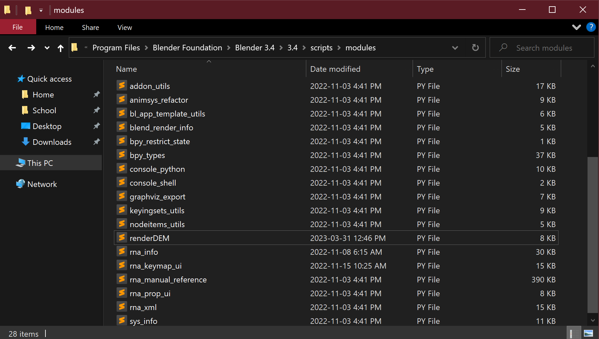

<p align="center">
  <a href="" rel="noopener">
 </a>
</p>

<h1 align="center">Blender DEM Visualization Toolkit</h3>

---
 
## 📝 Table of Contents <a name = 'contents'</a>
- [About](#about)
- [Getting Started](#getting_started)
- [Installation](#installation)
- [Functions in this Module](#functions)
    - [fetchDEM()](#fetch)
    - [geotiffToImage](#toimage)
    - [simplifyDEM()](#simplify)
    - [renderDEM()](#render)
- [Blender Usage](#usage)
    - [Render from python script using terminal](#terminal)
    - [Render from python script using GUI](#gui)
    - [Usage tips](#tips)
- [Acknowledgements](#acknowledgements)

<br/>

## 🧐 About <a name = "about"></a>
This is a python module of functions for creating 3D hillshade maps using Blender. It enables users with minimal Blender knowledge to fetch, clean, and visualize DEM data in the form of beautifully rendered hillshade maps.


This module is ultimately centered around its `renderDEM()` function which interfaces with Blender in order to generate a 3D rendered hillshade map using an input DEM image file.

### What is DEM Data?
A digital elevation model (DEM) is a 3D representation of a terrain's surface, created using remote sensing technologies to model the elevation of the ground. A DEM image is simply a visual representation of a digital elevation model (DEM), created by rendering the elevation data in a way that is easy to understand and interpret. Typically, within a DEM image each pixel carries its elevation data as values closer to white are higher and values closer to black are lower. These images can be fed into Blender to visualize this information in 3D space, creating high quality "hillshade" maps for use in cartography.

<br/>

## 🏁 Getting Started <a name = "getting_started"></a>
- Requirements:
    - [Blender](https://www.blender.org/download/)
    - [OpenTopography API key](https://portal.opentopography.org/lidarAuthorizationInfo?s=api)
    - Python 3.9


- Python dependencies:
    - PIL
    - requests
    - rasterio

This module requires an installation of **Blender**, a free and open-source 3D modelling software, in order to utilize the `renderDEM()` function. At the time of writing, this module is working as of Blender 3.5 (latest version) and can be downloaded [here](https://www.blender.org/download/).


This module also requires an [OpenTopography API key](https://portal.opentopography.org/lidarAuthorizationInfo?s=api), obtained for free by creating an account with OpenTopography, in order to to utilize the `fetchDEM()` function. This must be done in order for the function to access the global DEM datasets hosted by OpenTopography through their API.

## 🔧 Installation <a name = "installation"></a>
Please follow the following steps to install this package and enable its functionality both with fetching DEM images (using OpenTopography), as well as rendering images (using Blender)

### Step 1: Preliminary Steps
To install this module, begin by first downloading [Blender](https://www.blender.org/download/) as well as obtain an [OpenTopography API key](https://portal.opentopography.org/lidarAuthorizationInfo?s=api).

### Step 2: Install Package Through Git
Then run the following command in your terminal:

`pip install git+https://github.com/Seb-B-364/BlenderMapDEM.git`


At this point, all functions within this package **EXCEPT** `renderDEM()` can be used in your own python developer environment. You should now have the ability to fetch and work with DEM data.


The reason you cant use the `renderDEM()` function at this point is because it makes use of Blender's built in `bpy` package which will be run automatically when a script containing the `renderDEM()` function is fed into Blender using the GUI or terminal. You do not need to have this package installed on your system's python installation, it is already installed in Blender's.


If you call `renderDEM()` right now in a script you feed to Blender it will raise an error because it doesnt know where that function is. To add it to Blender see the following step.

### Step 3: Add renderDEM.py to Blender's Modules Folder
Blender runs on an entirely separate python installation (based on python 3.7) and installing packages/modules with custom functions beyond its defaults can be tricky and tiresome as `pip` does not work natively.


To get around this we can simply add the python file within this package containing the `renderDEM()` function to Blenders own modules folder. This will allow any script that is given to python containing `renderDEM()` to run without errors.


First go to the directory this package was installed in to access its files and **copy** the `renderDEM.py` file (alternatively you could download this repository as a zip file and copy the file from there). By default (on Windows as of python 3.9) this is found here:

`C:\Users\USERNAME\AppData\Local\Programs\Python\Python39\Lib\site-packages\BlenderMapDEM`


Then **paste** this file into Blender's `scripts/modules` folder so the `renderDEM()` function will be callable by Blender's python interpreter. By default (as of Blender 3.5 and on Windows) this folder is found here:

`C:\Program Files\Blender Foundation\Blender 3.5\3.5\scripts\modules`




### Step 4: Using the Package
To import this module into python scripts and use all its functions **EXCEPT** `renderDEM()`, add the following to your script.py:
```Python
# Import package
from BlenderMapDEM import * # or: import BlenderMapDEM as dem

# Example function call
fetchDEM(north_bound = 50, south_bound = 49, east_bound = 81, west_bound = 80, API_Key = '8da2375367b589517231f8fee1ae6b7c', output_dir = './output_DEM_here.tif', dataset = 'SRTMGL1')
```


To import the `renderDEM()` function and create a map using Blender, add the following to a script.py you feed to Blender (do not add anything else to this file):
```Python
# Import package (notice that we import renderDEM, not BlenderMapDEM, as that is the module added to Blenders module directory)
from renderDEM import * # or: import renderDEM as dem

# Example function call to generate map
renderDEM(dem_dir = 'path/to/dem.tif', output_dir = 'path/to/outputRender.png', exaggeration = 0.5, shadow_softness = 75, sun_angle = 45, resolution_scale = 25, samples = 2)
```


For more information on using Blender to execute this script, see the [Blender Usage](#usage) section.

<br/>

## 📦 Functions in this Module <a name = "functions"></a>
Below you will find documentation surrounding the functions featured in this module, their parameters, and usage examples.


The functions are roughly organized in the order they would most likely be used in, if you wish to find a specific function refer to the [table of contents](#contents)

### fetchDEM() <a name = "fetch"></a>
```Python
fetchDEM(north_bound, south_bound, east_bound, west_bound, API_Key, output_dir, dataset = 'SRTMGL1')
```

Uses the OpenTopography API in order to fetch a .GeoTIFF raster image containing DEM metadata for your specified extent that can then be opened using GIS programs. Fetching data may take a few minutes depending on size of request.


It is important to note that each dataset has limitations on the amount of area it can retrieve, and that fetching DEM data of a very large extent may result in long query times. Requests are limited to 500,000,000 km2 for GEDI L3, 125,000,000 km2 for SRTM15+ V2.1, 4,050,000 km2 for SRTM GL3, COP90 and 450,000 km2 for all other data.


The resulting .GeoTIFF DEM image, while openable in GIS programs, cannot be opened directly by a standard image viewer or Blender. This is so other geospatial operations can be performed on the DEM before it is imported into Blender using its geographic metadata.


**NOTE:** This function requires an OpenTopography API key in order to fetch maps from their database, obtained through [creating an account](https://portal.opentopography.org/newUser) on the OpenTopography website,


Parameters:
- `north_bound: float` **Requires float**
    - Latitude coordinate of the northern bound of chosen DEM extent.
    - This value must be greater than `south_bound` in order to create a valid bounding box. Acceptable values range **between 90 and -90.**
- `south_bound: float` **Requires float**
    - Latitude coordinate of the southern bound of chosen DEM extent.
    - This value must be less than `north_bound` in order to create a valid bounding box. Acceptable values range **between 90 and -90.**
- `east_bound: float` **Requires float**
    - Longitude coordinate of the eastern bound of chosen DEM extent.
    - This value must be greater than `west_bound` in order to create a valid bounding box. Acceptable values range **between 180 and -180.**
- `west_bound: float` **Requires float**
    - Longitude coordinate of the western bound of chosen DEM extent.
    - This value must be less than `east_bound` in order to create a valid bounding box. Acceptable values range **between 180 and -180.**
- `API_Key: str` **Requires string**
    - OpenTopography API key, required for the function to fetch global DEM data made available by OpenTopography. Obtained free [here](https://portal.opentopography.org/lidarAuthorizationInfo?s=api).
- `output_dir: str` **Requires string**
    - Directory path of the fetched DEM (including .tif file extension).
    - Depending on the directory this function is being called in, you can use the relative path prefix `./` like this: `./output_here.tif` in order to save the output file in the directory it is called in.
        - Example: `'absolute/path/to/output.tif'` or `./relative_path_to_output.tif`
- `dataset: str` **Requires string and defaults to 'SRTMGL1'** 

    - Specifies the global raster DEM dataset hosted on OpenTopography to fetch data from.
    - Different datasets have different coverage, quality, cell resolution, or fetchable area limitations. In general, `'SRTMGL3'` (90m cell resolution) and `'SRTMGL1'` (30m cell resolution) are very high quality and widely used.
    - Available DEM datasets:
        - `'SRTMGL3'` (SRTM GL3 90m)
        - `'SRTMGL1'` (SRTM GL1 30m)
        - `'SRTMGL1_E'` (SRTM GL1 Ellipsoidal 30m)
        - `'AW3D30'` (ALOS World 3D 30m)
        - `'AW3D30_E'` (ALOS World 3D Ellipsoidal, 30m)
        - `'SRTM15Plus'` (Global Bathymetry SRTM15+ V2.1)
        - `'NASADEM'` (NASADEM Global DEM)
        - `'COP30'` (Copernicus Global DSM 30m)
        - `'COP90'` (Copernicus Global DSM 90m)
        - `'EU_DTM'` (DTM 30m)
        - `'GEDI_L3'` (DTM 1000m)


Usage example:
```Python
# The following code fetches DEM data from OpenTopography using the SRTM GL1 30m dataset and a hypothetical API key

Key = '8da2375367b589517231f8fee1ae6b7c'

fetchDEM(north_bound = 50, south_bound = 49, east_bound = 81, west_bound = 80, API_Key = Key, output_dir = 'path/to/output/DEM.tif', dataset = 'SRTMGL1')
```

<br/>

### geotiffToImage() <a name = "toimage"></a>
```Python
geotiffToImage(dem_dir, output_dir)
```

Converts a .geotiff file (such as one gotten from OpenTopography) to a viewable image file that can be imported by non-GIS programs such as Blender. This allows the user to not have to import the OpenTopography .geotiff DEM file into GIS software and then export it as a viewable rendered image.


It is important to note that the resulting image is currently saved with **8-bit color depth**, meaning that elevation values stored in each pixel can exist in a range from 0-256. This is not ideal however the impacts to the image quality and the resulting 3D renders made from these images are extremely minimal.


It is also important to note that this function outputs an image file that, while readable by image viewers and Blender, is devoid of all geospatial metadata. Use this function towards the end your workflow before `simplifyDEM()` and `renderDEM()` when such metadata is no longer needed to generate a map.


Parameters:
- `dem_dir: str` **Requires string**
    - Directory of the input DEM .geotiff file including its .tif file extension. 
    - Depending on the directory this function is being called in, you can use the relative path prefix `./` like this: `./DEM_here.tif` to select the DEM file in the directory it is called in.
        - Example: `'absolute/path/to/DEM.tif'` or `./relative_path_to_DEM.tif`
- `output_dir: str` **Requires string**
    - Directory path of the output image file including file extension.
    - Depending on the directory this function is being called in, you can use the relative path prefix `./` like this: `./output_here.tif` in order to save the output file in the directory it is called in.
        - Example: `'absolute/path/to/output.png'` or `./relative_path_to_output.png`
    - While all standard image formats are acceptable as output, **converting the image to .png** is highly recommended as it results in the best quality retention.
    

Usage example:
```Python
# The following code takes a non-viewable .geotiff DEM image and convert it into a viewable image that is readable by non-GIS programs such as Blender

geotiffToImage(dem_dir = 'path/to/dem.tif', output_dir = 'path/to/outputImage.png')
```

<br/>

### simplifyDEM() <a name = "simplify"></a>
```Python
simplifyDEM(dem_dir, output_dir, reduction_factor = 2)
```

Uses the PIL package to read in an input DEM image (of likely a high resolution) and output a down-sampled image with lower file size and resolution using a resample method appropriate for DEM maps. May be helpful depending on your DEM data source for easing resource requirements when rendering images in Blender.


**NOTE:** this function currently does not work with .GeoTIFF files which contain geospatial metadata and must be opened in GIS programs, this method is intended to be used to prepare a viewable image file before it is imported into Blender to ease computational requirements on computers.


Parameters:
- `dem_dir: str` **Requires string**
    - Directory of the input DEM image including its file extension. All standard image file types **except .jpg and .jpeg** are acceptable as input **including .tif/.tiff files**.
    - Depending on the directory this function is being called in, you can use the relative path prefix `./` like this: `./DEM_here.tif` to select the DEM file in the directory it is called in.
        - Example: `'absolute/path/to/DEM.tif'` or `./relative_path_to_DEM.tif`
- `output_dir: str` **Requires string**
    - Directory path of the outputted down-sampled image including its file extension. All standard image file types **except .jpg and .jpeg** are acceptable as output **including .tif/.tiff files**.
    - Depending on the directory this function is being called in, you can use the relative path prefix `./` like this: `./output_here.tif` in order to save the output file in the directory it is called in.
        - Example: `'absolute/path/to/output.tif'` or `./relative_path_to_output.tif`
    - Note that the output file can be the same as the input file and the function will overwrite the input file with the new resolution. This may be convenient for keeping a clean working directory however is more destructive as changes to the file cannot be reverted.
- `reduction_factor: int` **Requires integer and defaults to 2 (halves resolution)**
    - Refers to the integer by which to divide the input DEM resolution by. A `reduction_factor = 4` will result in a down-sampled image with a quarter of the original resolution, whereas a `reduction_factor = 10` will result in a down-sampled image with a tenth of the original resolution.
    - **Must be equal or greater than 2**
    - Be gentle with the amount you reduce the resolution by, depending on the size of your input image, reducing the resolution by more than half could have negative impacts on its clarity in the final rendered image.


Usage example:
```Python
# The following code reduces the resolution of the input DEM to be a quarter of its original

simplifyDEM(dem_dir = 'path/to/dem.tif', output_dir = 'path/to/outputRender.png', reduction_factor = 4)
```

<br/>

### renderDEM() <a name = "render"></a>
```Python
renderDEM(dem_dir, output_dir, exaggeration = 0.5, shadow_softness = 90, sun_angle = 45, resolution_scale = 50, samples = 5)
```

Uses Blender to generate a 3D rendered hillshade map image using an input DEM image file. The input DEM image must be viewable by non-GIS software, use `geotiffToImage()` to convert fetched DEM data into an image readable by Blender before using this function.


**NOTE:** this function is intended to be run directly by Blender (either through the terminal or GUI), utilizing Blender's own python installation and `bpy` package. This function **WILL NOT WORK** if it is called from a script that is run by a normal python installation because it wont be able to use Blender's capabilities to render the image.


For more information on using Blender to execute this function, see the [Blender Usage](#usage) section.


Parameters:
- `dem_dir: str` **Requires string**
    - Directory of the input DEM image including its file extension. All standard image file types are acceptable, **including .tif/.tiff files**.
    - Make sure to specify the absolute path of the input DEM image
        - Example: `dem_dir = 'C:/Users/USERNAME/Desktop/DEM.tif'`
- `output_dir: str` **Requires string**
    - Directory of the output rendered map including its file extension. All standard image file types are acceptable, **including .tif/.tiff files**.
    - Make sure to specify the absolute path of the output rendered map
        - Example: `output_dir = 'C:/Users/USERNAME/Desktop/render.png'`
- `exaggeration: float` **Requires float and defaults to 0.5**
    - Level of topographic exaggeration to be applied to 3D plane based on input DEM. Higher values will result in "spiky" terrain and darker crevices between landforms when viewed from above.
    - Generally values between 0.3 (relatively flat) to 1 (very spiky) produce good maps however there is no limit to how high this value can go
    - Note that negative values are possible and will reverse the direction the terrain is exaggerated, "carving" the landscape underground.
- `shadow_softness: float` **Requires float and defaults to 90 (relatively soft)**
    - This value specifically refers to the angular diameter of the sun's light source however functionally it can be understood as shadow softness.
    - Acceptable values range from 0-180 however best results will come between values of around 10-90; **values below 0 will be treated as 0 and values above 180 will be treated as 180.**
    - Low values (0-10) will result in very hard shadows as if the landscape is on the moon, and higher values (45-90) will result in softer more natural shadows
    - Values approaching 180 may result in unusual shadows.
- `sun_angle: float` **Requires float and defaults to 45 (degrees)**
    - Vertical angle the sun is shining down on in degrees, mimicking how high the sun is in the sky.
    - Acceptable values range from 0-90; values both above 90 and below 0 are possible however may result in unusual shadows as the sun will shine from realistically impossible angles.
    - For reference a value of 90 will have the sun shining horizontally, a value of 0 will have it shining straight down, and a value of 45 will have it shining diagonally down allowing moderate shadows to be cast on the landforms.
- `resolution_scale: int` **Requires integer and defaults to 50**
    - Scale of the rendered image resolution in relation to the input DEM resolution in the form of percentage. An input DEM with resolution 2000x2000 and a `resolution_scale = 100` will result in a rendered image with resolution 2000x2000 (100% of input DEM), whereas `resolution_scale = 50` will result in a final render of 1000x1000 (50% of input DEM).
    - It is recommended to keep this value around or below 50 while performing test renders to improve speed before raising it to 100 for the final render at full resolution. Has a great affect on render speed and resource load on computer.
- `samples: int` **Requires integer and defaults to 5**
    - Amount of samples to be used in the final render. Samples can be understood as how many "passes" Blender takes over the image during the rendering process, refining the image more and more each sample/pass, making it more clear and less noisy. Has an **extremely large** affect on render speed and resource load on computer.
    - Depending on the strength of your computer it is recommended to keep this value very low (from 1-10) while performing test renders before your final render where you can then raise it to anywhere from 20-500+ for crisp image quality.


When in doubt, the default values of the stylistic parameters `exaggeration`, `shadow_softness`, and `sun_angle` will result in a very readable and realistic hillshade that can be then strayed from conservatively to your liking.


Usage example:
```Python
# The following code uses Blender to render a 3D hillshade map

# Notice the very conservative resolution_scale and samples values,
# do not underestimate the length of time it takes to render image with these values set too high

renderDEM(dem_dir = 'path/to/dem.tif', output_dir = 'path/to/outputRender.png', exaggeration = 0.5, shadow_softness = 75, sun_angle = 45, resolution_scale = 25, samples = 2)
```

<br/>

## 🗺️ Blender Usage <a name = "usage"></a>
**IMPORTANT:** The following methods will render a map based on your python script using Blender's own python installation and interpreter. This means it does not have any packages installed other than its own default bpy package (and some others). There are likely ways around this that install outside packages (like this one) into Blender easily however it is beyond the scope of this project. For this reason it is important that the script you feed into Blender to render your 3D map **ONLY contains your function call of `renderDEM()`** and your chosen argument parameters like this...


Example script.py:
```Python
# Script to render a 3D hillshade map in Blender
from renderDEM import * # Note that we import renderDEM (NOT BlenderMapDEM)

# Remember to replace USERNAME with your system username
renderDEM(dem_dir = 'C:/Users/USERNAME/OneDrive/Desktop/DEM.tif', output_dir = 'C:/Users/USERNAME/OneDrive/Desktop/render.png', exaggeration = 0.5, shadow_softness = 50, sun_angle = 35, resolution_scale = 100, samples = 50)

# End of script
```

<br/>

### 🖥️ Render Map from Python Script Using Terminal <a name = "terminal"></a>
Rendering your DEM map from the terminal is both more resource efficient and quicker to execute assuming you are familiar with the terminal.


- If Blender is not added to your PATH:
    - In your terminal navigate to your Blender installation directory that contains your Blender.exe file. On Windows this defaults to: `C:\Program Files\Blender Foundation\Blender 3.5` as of Blender 3.5.
    - To run a python script which contains the renderDEM() function, input `./Blender.exe --background --python path/to/script.py` into your terminal (working on Git Bash, syntax for executing applications from the terminal may differ slightly between terminal clients).
    - This will render a DEM image to the directory specified in your renderDEM() function WITHOUT opening Blender's GUI.


- If Blender is added to your PATH:
    - You should be able to run Blender from anywhere in your terminal. You can be sure it is added to your PATH if running "Blender" in your terminal from any directory opens a Blender instance. (see LINK for adding Blender to PATH).
    - To run a python script which contains the renderDEM() function, input `Blender --background --python path/to/script.py` into your terminal (working on Git Bash, syntax for executing applications from the terminal may differ slightly between terminal clients).
    - This will render a DEM image to the directory specified in your renderDEM() function WITHOUT opening Blender's GUI.


- For more information on starting Blender from the command line see [here](https://docs.Blender.org/manual/en/dev/advanced/command_line/launch/index.html).

<br/>

### 🖥️ Render Map from Python Script Using GUI <a name = "gui"></a>
While rendering from the terminal is quicker and more resource efficient for a single render, it may be simpler if you are not that familiar with the command line to render using Blender's GUI.


Using the GUI has a slight improvement in convenience if you wish to rerun the script and try out its different parameters as you can use the built-in text editor in the "Scripting" workspace to edit parameters on the fly.


**NOTE:** the renderDEM() function is intended to work on a **new** Blender project file that features the default cube, camera, and light. If you already have Blender open and have made any changes to your project, go to `File>New>General` to create a new project.


- Steps to render map using GUI:
    - When Blender starts, create a new default project by clicking the "General" template. Then, navigate to the "Scripting" workspace located at the far right along the top bar.
    
    - You should see a new workspace featuring a text editor and Blender's own python console. Along the top bar of the text editor click "Open Text" (folder icon).
    - Navigate to your python script (which imports module and calls the `renderDEM()` function) and open it.
    - Click the "Run Script" (play button icon) and the script should produce a rendered image according to the parameters specified in the renderDEM() function.
    - If you wish to make changes and run the script again, simply change the parameters in your imported `script.py` function call and hit the play button again.

<br/>

### 💡 Usage Tips <a name = "tips"></a>
For `renderDEM()`, It is recommended to start with **very** conservative quality settings (arguments of `resolution_scale` and `samples`) so that you are able to quickly perform many test renders while you fine-tune the stylistic arguments before your final high-quality render. This is because different input maps may have better readability with certain scale exaggerations, colors, shadows, etc. and rendering a high-quality map every time to tweak these parameters would require an unnecessary amount of time and resources.


Use [latlong.net](https://www.latlong.net/) to help you find the north, south, east, and west bounds of your chosen area to use with the `fetchDEM()` function.

<br/>

## 🙌 Acknowledgements <a name = "acknowledgements"></a>
- This documentation was created with reference from the following template created by [@kylelobo](https://github.com/kylelobo), accessible [here](https://github.com/kylelobo/The-Documentation-Compendium/blob/master/en/README_TEMPLATES/Standard.md)